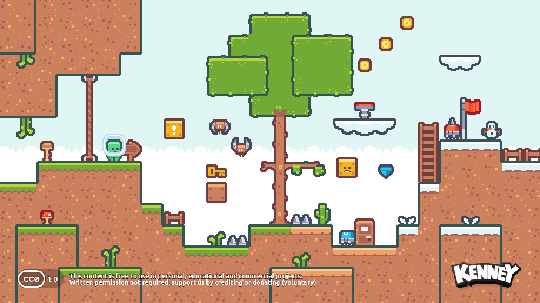

# Pixel Platformer

A simple Godot 4 platformer game using a finite state machine.

---

## Resources:

### Kenney's Pixel Platformer assets

### HeartBeast's Pixel Platformer Tutorial / Code Along

### The Shaggy Dev's finite state machine

Source code available [here](https://github.com/theshaggydev/the-shaggy-dev-projects/tree/main/projects/godot-3/advanced-state-machine)

#### Introduction

#### Implementing the state pattern in Godot

####  Building a more advanced state machine in Godot 

